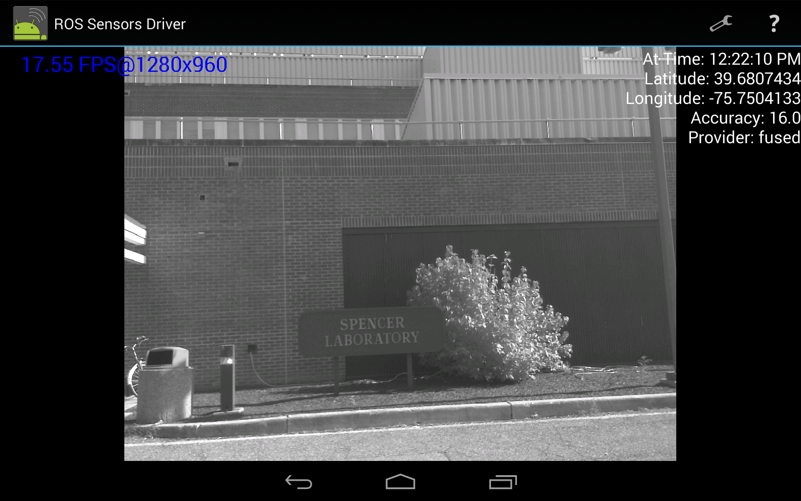
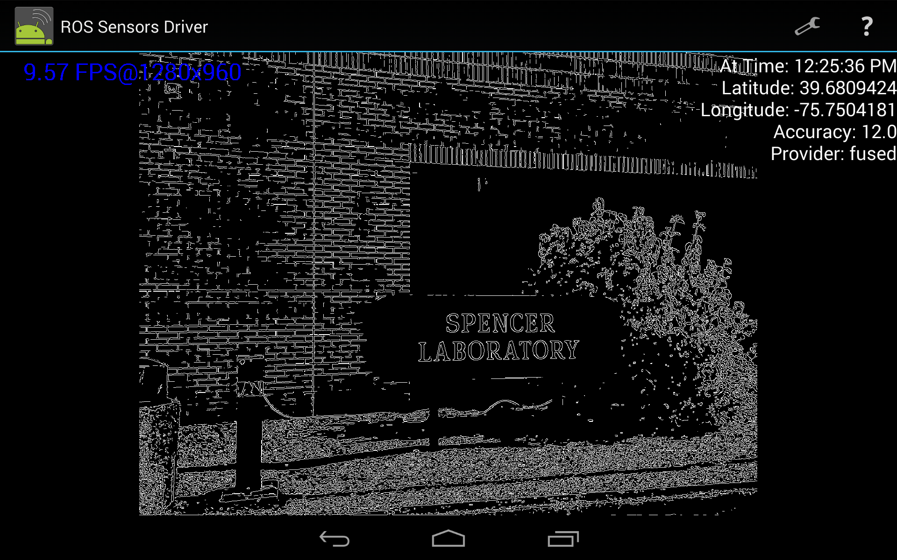

# ROS Driver for Android Sensors
This is a nice android application that allows for publishing of data from a phone to a publish ROS master.
This can be used to record a ROS bag of data or to preform SLAM on a higher powered computer.
Note that this only works on phones that use the Camera1 API (so no newer camera2 api phones).
If you are interested in recording data for a Camera2 API phone check out our other repository [android-dataset-recorder](https://github.com/rpng/android-dataset-recorder).
Also note that on some phones the number of cameras that you can use is limited (and thus if you select more the app will fail).
This is caused by a limit to the bandwidth over the camera buses on the physical phone hardware.

## How to compile and install?

* Downlaod Android Studio and install https://developer.android.com/studio/index.html
* run `git clone https://github.com/rpng/android_sensors_driver.git android_sensor_project`
* open android_sensor_porject as existing project in Android Studio
* Press run button
* Build will fail but suggest to install missing frameworks. Click on the link, install missing, and press run again.
* You can choose to run on a simulator or on your phone
  * Phone
    * Your phone must have developer mode enabled.
    * Enter IP of rosmaster
  * Emulator
    * IP of localhost of emulator computer is 10.0.0.2
    * Enter 10.0.0.2 in your app in emulator, if ros is running at your local computer as well

## Screenshots

